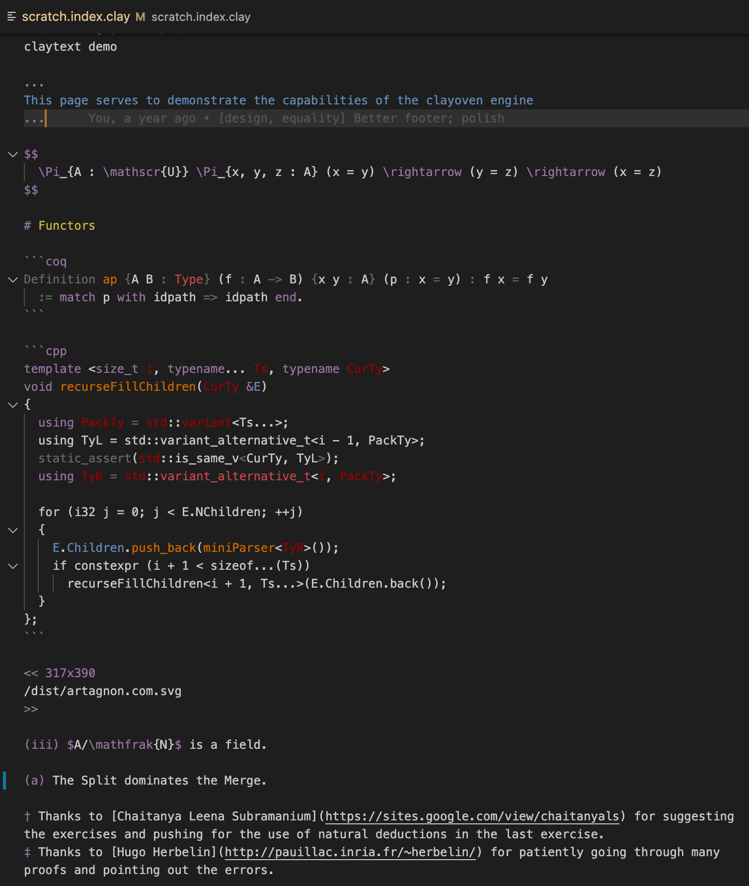

# vsclay

A full-featured vscode extension to syntax-highlight [claytext](https://github.com/artagnon/clayoven) with IntelliSense support for [MathJaX](https://mathjax.org). Uses injection-grammars to syntax-highlight embedded MathJaX, Coq, Haskell, Rust, and C++.

